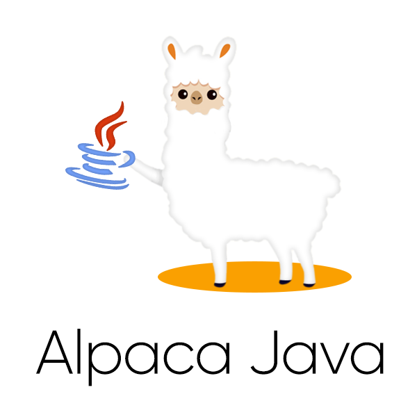

<p align="center"><a href="https://petersoj.github.io/alpaca-java/" target="_blank"></a></p>
<p align="center">
    <a href="https://github.com/Petersoj/alpaca-java" target="_blank"></a>
    <a href="https://search.maven.org/artifact/net.jacobpeterson.alpaca/alpaca-java" target="_blank"></a>
    <a href="https://javadoc.io/doc/net.jacobpeterson.alpaca/alpaca-java" target="_blank"></a>
    <a href="https://opensource.org/licenses/MIT" target="_blank"></a>
</p>

# Overview
This library is a Java client implementation of the <a href="https://alpaca.markets/">Alpaca</a> API. Alpaca lets you trade with algorithms, connect with apps, and build services all with a commission-free trading API for stocks, crypto, and options. This library uses the [Alpaca OpenAPI Specifications](https://docs.alpaca.markets/v1.1/openapi) to generate clients for the REST API with the [OkHttp](https://square.github.io/okhttp/) library, but implements the websocket and SSE streaming interface using a custom implementation with the [OkHttp](https://square.github.io/okhttp/) library. This library is community developed and if you have any questions, please ask them on [Github Discussions](https://github.com/Petersoj/alpaca-java/discussions), the [Alpaca Slack #dev-alpaca-java channel](https://alpaca.markets/slack), or on the [Alpaca Forums](https://forum.alpaca.markets/).

Give this repository a star ⭐ if it helped you build a trading algorithm in Java!

# Gradle and Maven Integration
If you are using Gradle as your build tool, add the following dependency to your `build.gradle` file:

```
implementation group: "net.jacobpeterson.alpaca", name: "alpaca-java", version: "10.0.0"
```

If you are using Maven as your build tool, add the following dependency to your `pom.xml` file:

```
<dependency>
    <groupId>net.jacobpeterson.alpaca</groupId>
    <artifactId>alpaca-java</artifactId>
    <version>10.0.0</version>
</dependency>
```

Note that you don't have to use the Maven Central artifacts. Instead, you can clone this repository, build this project, and install the artifacts to your local Maven repository as shown in the [Building](#building) section.

# Logger
For logging, this library uses [SLF4j](http://www.slf4j.org/) which serves as an interface for various logging frameworks. This enables you to use whatever logging framework you would like. However, if you do not add a logging framework as a dependency in your project, the console will output a message stating that SLF4j is defaulting to a no-operation (NOP) logger implementation. To enable logging, add a logging framework of your choice as a dependency to your project such as [Logback](http://logback.qos.ch/), [Log4j 2](http://logging.apache.org/log4j/2.x/index.html), [SLF4j-simple](http://www.slf4j.org/manual.html), or [Apache Commons Logging](https://commons.apache.org/proper/commons-logging/).

# Examples
Note that the examples below are not exhaustive. Refer to the [Javadoc](https://javadoc.io/doc/net.jacobpeterson.alpaca/alpaca-java) for all classes and method signatures.

## [`AlpacaAPI`](src/main/java/net/jacobpeterson/alpaca/AlpacaAPI.java)
[`AlpacaAPI`](src/main/java/net/jacobpeterson/alpaca/AlpacaAPI.java) is the main class used to interface with the various Alpaca API endpoints. If you are using the Trading or Market Data APIs for a single Alpaca account or if you are using the Broker API, you will generally only need one instance of this class. However, if you are using the Trading API with OAuth to act on behalf of an Alpaca account, this class is optimized so that it can be instantiated quickly, especially when an existing `OkHttpClient` is given in the constructor. Additionally, all API endpoint instances are instantiated lazily. This class is thread-safe.

The Alpaca API documentation is located [here](https://docs.alpaca.markets/) and the [`AlpacaAPI`](src/main/java/net/jacobpeterson/alpaca/AlpacaAPI.java) Javadoc is located [here](https://javadoc.io/doc/net.jacobpeterson.alpaca/alpaca-java/latest/net/jacobpeterson/alpaca/AlpacaAPI.html).

Example usage:
```java
// TODO
```

Note that this library uses [OkHttp](https://square.github.io/okhttp/) as its HTTP client library which creates background threads to service requests via a connection pool. These threads persist even if the main thread exits, so if you want to destroy these threads when you're done using [`AlpacaAPI`](src/main/java/net/jacobpeterson/alpaca/AlpacaAPI.java), call `alpacaAPI.closeOkHttpClient();`.

## Trading API
```java
// TODO
```

## Market Data API
```java
// TODO
```

## Broker API
```java
// TODO
```

# Building
To build this project yourself, clone this repository and run:
```
./gradlew build
```

To install the built artifacts to your local Maven repository on your machine (the `~/.m2/` directory), run:
```
./gradlew publishToMavenLocal
```

# TODO
- Implement Unit Testing for REST API and Websocket streaming (both live and mocked)

# Contributing
Contributions are welcome!

Do the following before starting your Pull Request:
1. Create a new branch in your forked repository for your feature or bug fix instead of committing directly to the `master` branch in your fork.
2. Use the `dev` branch as the base branch in your Pull Request.
